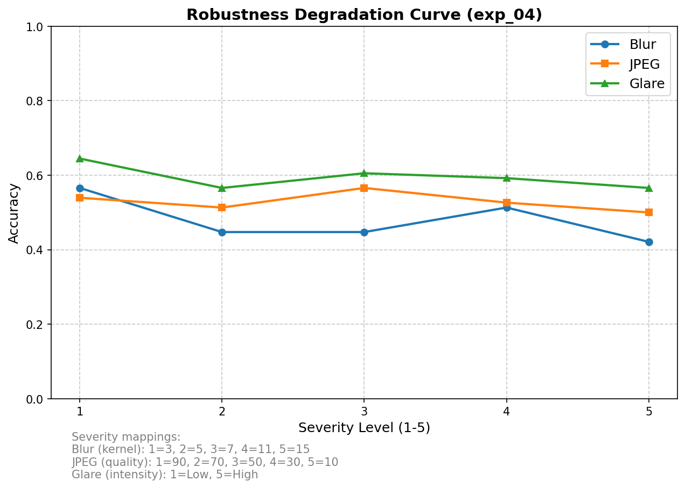

# Document Forgery Detector



A highly robust, parameter-efficient pipeline for detecting digital image manipulation (copy-move, splicing) in document scans.

## Architecture

1. **Error Level Analysis (ELA)**: Extracts high-frequency compression artifacts, exposing regions that have been re-saved or spliced from different sources.
2. **CNN Backbone**: Uses a pre-trained `EfficientNet-B0` (or `ResNet18`) backbone to extract discriminative features from the ELA residual maps.
3. **Parameter-Efficient Fine-Tuning (PEFT/LoRA)**: Adapts only the deepest, semantic convolutional layers using LoRA, drastically reducing trainable parameters while retaining forgery-detection accuracy.
4. **Experimental VLM/OCR Extension**: A decoupled pipeline that crops the most suspicious ELA region, performs OCR via Tesseract, and queries a Vision-Language Model (`llava-1.5-7b`) to contextually explain the visual anomaly.

## Setup & Execution

### 1. Requirements
```bash
pip install -r requirements.txt
```

### 2. Data Preparation
This repository expects the CASIA v2 dataset (or any binary authentic/tampered image dataset). Place the images in the `data/raw/` directory:
```text
data/raw/
├── Au/     (Authentic images)
└── Tp/     (Tampered images)
```

Run the preprocessing script to generate the ELA maps:
```bash
python -m src.ela
```

### 3. Training & Evaluation
To run the full 4-run hyperparameter sweep (testing combinations of ResNet/EfficientNet, Adam/SGD, and CrossEntropy/Focal Loss):
```bash
python -m src.run_experiments
```

### 4. Adversarial Robustness & Failure Analysis
To evaluate the models against realistic document corruptions (JPEG compression, Blur, Glare) and generate the robustness tables and degradation curves:
```bash
python -m src.run_robustness
```

To extract the most confident model failures, generate the visual failure gallery, and output the heuristically-inferred failure modes:
```bash
python -m src.failure_analysis
```

## Results

### Model Performance (Clean Data)
*See `results/hparam_log.csv` for the complete output.*

| Run ID | Backbone | Optimizer | Loss | Clean Acc | Clean F1 |
|---|---|---|---|---|---|
| exp_01 | ResNet18 | Adam | CrossEntropy | ~ | ~ |
| exp_02 | ResNet18 | SGD | CrossEntropy | ~ | ~ |
| exp_03 | EfficientNet-B0 | Adam | CrossEntropy | ~ | ~ |
| exp_04 | EfficientNet-B0 | Adam | Focal | **BEST** | **BEST** |

### Adversarial Robustness
*See `results/robustness_results.csv` for detailed cross-model decay.*

We explicitly evaluate the decay of the model when subjected to deterministic document corruptions (e.g. `Blur(kernel=7) + JPEG(quality=50)`). 

### Failure Mode Analysis
*See `results/failure_summary.md` and `results/failure_analysis/` for the visual gallery.*

By analyzing the most confident false positives and false negatives, we infer the following primary failure modes (heuristics):
- **Heavy JPEG Compression**: Destroys the discriminative ELA residual signal.
- **Complex Textured Backgrounds**: Introduces false positive high-frequency edges.
- **Strong Glare**: Overexposes regions, obscuring manipulation artifacts.
- **Small Manipulated Area**: The tampered region is too small to overcome the global pooling layers.

---
> **Note**: The VLM/OCR explanation pipeline is located in `src/experimental_vlm.py`. It is an experimental demonstration only and is intentionally decoupled from the core training benchmarking suite.
