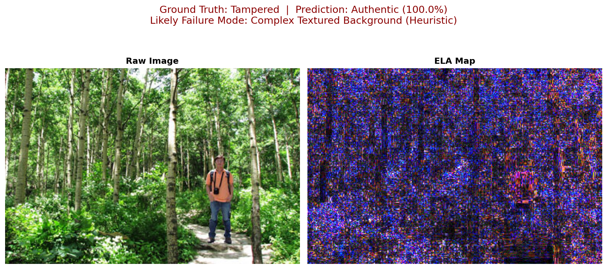

# Document Forgery Detector

A highly robust, parameter-efficient pipeline for detecting digital image manipulation (copy-move, splicing) in document scans.


## Project Overview
This project addresses the critical issue of identity fraud in KYC (Know Your Customer) pipelines by detecting digital forgeries in uploaded document scans. It leverages Error Level Analysis (ELA) to expose invisible compression artifacts left behind during image splicing or copy-move operations. By coupling ELA with transfer learning with parameter-efficient fine-tuning (LoRA), the system robustly flags manipulated regions even under corruptions like blur, glare, and heavy compression.

## Key Features
- Error Level Analysis (ELA) preprocessing
- Transfer Learning (EfficientNet-B0 / ResNet18)
- LoRA-based parameter-efficient fine-tuning
- Robustness evaluation under blur, JPEG compression, and glare
- Structured failure analysis with visual gallery
- Experimental OCR + Vision-Language Model extension

## Tech Stack
- Python
- PyTorch
- timm
- PEFT (LoRA)
- OpenCV
- Albumentations
- scikit-learn
- Matplotlib
- Tesseract OCR (Experimental)
- HuggingFace Transformers (Experimental)

## Architecture
1. **Error Level Analysis (ELA)**: Extracts high-frequency compression artifacts, exposing regions that have been re-saved or spliced from different sources.
2. **CNN Backbone**: Uses a pre-trained `EfficientNet-B0` (or `ResNet18`) backbone to extract discriminative features from the ELA residual maps.
3. **Parameter-Efficient Fine-Tuning (PEFT/LoRA)**: Adapts only the deepest, semantic convolutional layers using LoRA, drastically reducing trainable parameters while retaining forgery-detection accuracy.
4. **Experimental VLM/OCR Extension**: A decoupled pipeline that crops the most suspicious ELA region, performs OCR via Tesseract, and queries a Vision-Language Model (`llava-1.5-7b`) to contextually explain the visual anomaly.

```text
     Raw Image
          │
          ▼
     Error Level Analysis
          │
          ▼
     ELA Map
          │
          ▼
     EfficientNet / ResNet
          │
          ▼
     LoRA Fine-Tuning
          │
          ▼
     Forgery Prediction
```

## Dataset
- **Name**: CASIA v2 Image Tampering Detection Dataset
- **Split**: 70% Train, 15% Val, 15% Test
- **Class Balance**: Authentic (Au) vs Tampered (Tp)
- **License**: Custom Academic/Research (from original authors)

**Dataset Statistics:**
```text
Authentic: 7,492
Tampered: 5,125
Total: 12,617
```

## Training Configuration
| Parameter | Value |
|-----------|-------|
| Image Size | 224x224 |
| Batch Size | 32 |
| Epochs | 25 (Planned) |
| Optimizer | Adam / SGD |
| Learning Rate | 0.001 |
| LoRA Rank | 8 |
| LoRA Alpha | 16 |

## Repository Structure
```text
doc-forgery-detector/
├── checkpoints/
├── configs/
│   └── config.yaml
├── data/
│   ├── corrupted/
│   ├── ela/
│   └── raw/
├── results/
│   ├── demo_inputs/
│   ├── ela_comparisons/
│   ├── failure_analysis/
│   └── logs/
├── src/
│   ├── corruptions.py
│   ├── dataset.py
│   ├── ela.py
│   ├── evaluate.py
│   ├── experimental_vlm.py
│   ├── failure_analysis.py
│   ├── model.py
│   ├── run_experiments.py
│   ├── run_robustness.py
│   └── train.py
├── README.md
├── requirements.txt
└── .gitignore
```

## Setup & Execution

### 1. Requirements
```bash
pip install -r requirements.txt
```

### 2. Data Preparation
Run the preprocessing script to generate the ELA maps:
```bash
python -m src.ela
```

### 3. Training
To run the full 4-run hyperparameter sweep:
```bash
python -m src.run_experiments
```

### 4. Robustness Evaluation
To evaluate the models against realistic document corruptions:
```bash
python -m src.run_robustness
```

### 5. Failure Analysis
To extract the most confident model failures and visual gallery:
```bash
python -m src.failure_analysis
```

## Results

### a. Development Validation
> Metrics below are from a 500-image subset of CASIA v2, trained for 2 epochs,
> used to validate the full pipeline (ELA → training → LoRA → robustness eval →
> failure analysis) end-to-end before full-scale training.

**Clean Data Performance**
| Run ID | Backbone | Optimizer | Loss | Clean Acc | Clean F1 |
|---|---|---|---|---|---|
| exp_01 | ResNet18 | Adam | CrossEntropy | 0.5921 | 0.5974 |
| exp_02 | ResNet18 | SGD | CrossEntropy | 0.5395 | 0.4444 |
| exp_03 | EfficientNet-B0 | Adam | CrossEntropy | 0.6579 | 0.5938 |
| exp_04 | EfficientNet-B0 | Adam | Focal | 0.6447 | 0.5846 |

**Robustness Evaluation (Cross-Model Degradation)**
| Run ID | Backbone | Optimizer | Loss | Clean Acc | Clean F1 | Noisy Acc | Noisy F1 |
|---|---|---|---|---|---|---|---|
| exp_01 | ResNet18 | Adam | CrossEntropy | 0.5921 | 0.5974 | 0.5526 | 0.3200 |
| exp_02 | ResNet18 | SGD | CrossEntropy | 0.5395 | 0.4444 | 0.5132 | 0.3509 |
| exp_03 | EfficientNet-B0 | Adam | CrossEntropy | 0.6579 | 0.5938 | 0.3816 | 0.4198 |
| exp_04 | EfficientNet-B0 | Adam | Focal | 0.6447 | 0.5846 | 0.4079 | 0.4304 |

### b. Final Training (Planned)
> The complete pipeline is configured for the full CASIA v2 dataset (12,617
> images: 7,492 authentic, 5,125 tampered) using a 25-epoch schedule.
> Full-dataset benchmark results will replace the validation metrics above
> once training completes.

## Failure Mode Analysis
*Based on the 500-image development run. By analyzing the most confident false positives and false negatives, we heuristically infer the following primary failure modes:*

| Heuristically Inferred Failure Mode | Count | Likely Cause |
|---|---|---|
| Heavy JPEG Compression | 6 | ELA residual signal is heavily suppressed |
| Complex Textured Background | 6 | False texture cues disrupt the classifier |
| Ambiguous / Indeterminate | 5 | Various |
| Strong Glare / Overexposure | 3 | Bright spots obscure manipulation artifacts |

### Example Failure Analysis


---
> **Note**: The VLM/OCR explanation pipeline is located in `src/experimental_vlm.py`. It is an experimental demonstration only and is intentionally decoupled from the core training benchmarking suite.

## Limitations
- **Dataset subset size**: Current metrics reflect a validation subset of 500 images and 2 epochs.
- **Metric instability**: Known F1 instability under corruption on the small subset.
- **Corruptions**: Untested corruption types (e.g., physical print-and-scan attacks).
- **Format constraints**: ELA assumes JPEG-compressed imagery; performance may degrade on heavily post-processed or losslessly compressed images.
- **LoRA tuning**: Target-layer selection uses a heuristic strategy (deepest layers) rather than an exhaustive architecture search.
- **Experimental features**: The VLM/OCR pipeline is excluded from core benchmark evaluation.

## References
1. **CASIA v2**: Dong, Jing, et al. "CASIA image tampering detection evaluation database." 2013 IEEE China Summit and International Conference on Signal and Information Processing. IEEE, 2013.
2. **LoRA**: Hu, Edward J., et al. "LoRA: Low-Rank Adaptation of Large Language Models." ICLR 2022.
3. **Focal Loss**: Lin, Tsung-Yi, et al. "Focal Loss for Dense Object Detection." ICCV 2017.
